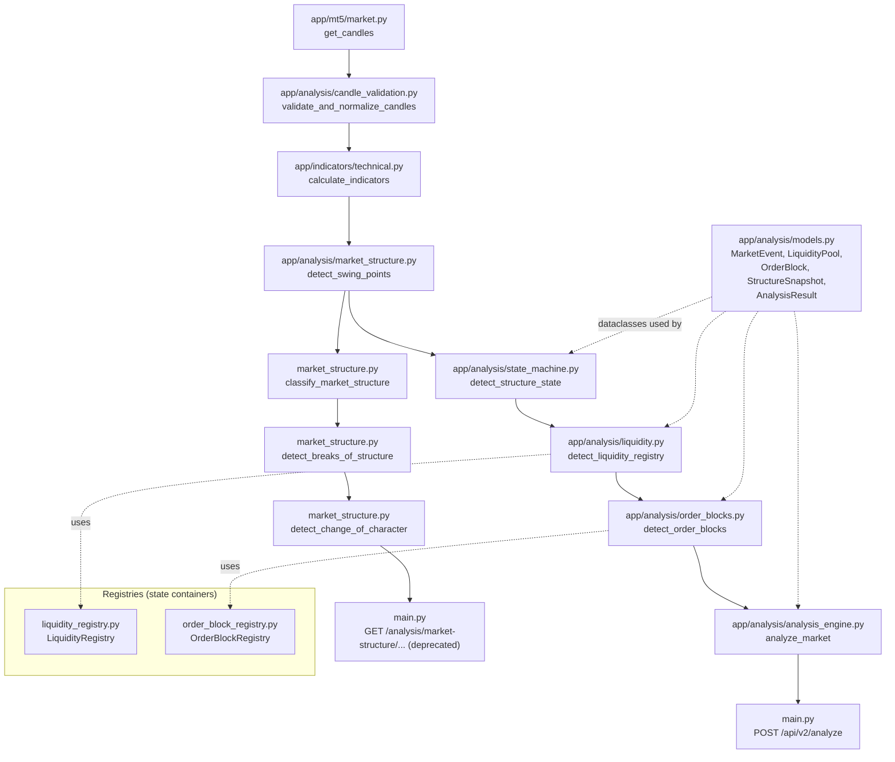

# Architecture

Status: describes the codebase as implemented today (post Phase 0–8, post-audit hardening). Governing source of truth for all *decisions* referenced here is [`SMC_SPECIFICATION.md`](../SMC_SPECIFICATION.md); this document explains how those decisions are realised in code, not the decisions themselves.

See also: [DATA_FLOW.md](DATA_FLOW.md) (column-level detail per stage), [STATE_MACHINE.md](STATE_MACHINE.md), [ORDER_BLOCKS.md](ORDER_BLOCKS.md), [API.md](API.md).

## 1. What this system is

A read-only analysis service over MetaTrader 5 (MT5) market data. It retrieves OHLC candles, computes technical indicators, and runs a Smart Money Concepts (SMC) structure-analysis pipeline (swing detection → market-structure classification → BOS/MSS/CHoCH state machine → liquidity pools → Order Blocks → a unified event stream), exposed over a FastAPI HTTP surface for consumption by MT5-adjacent tooling, n8n workflows, and LLM tool integrations.

It does not place trades and does not write to MT5. `/risk/trade-levels` computes suggested stop-loss/take-profit levels from caller-supplied inputs; it does not execute anything.

## 2. Design philosophy

### 2.1 Deterministic processing

Every analysis function is a pure function of its DataFrame input: same candles in, same output out, every time. No wall-clock reads, no random values, no external state consulted mid-computation (`app/mt5/*` is the *only* place real-world I/O happens, and it happens strictly before the pipeline runs, never during it). This is verified directly by the test suite: the full suite is run twice and in reverse file order as a standing regression gate (see [TESTING.md](TESTING.md#2-determinism)).

### 2.2 Single, causally-forward pass

`state_machine.py::detect_structure_state` computes swing classification (HH/HL/LH/LL) and BOS/MSS/CHoCH state transitions in **one** forward loop over the candle rows, not two. A row's classification depends only on state established at earlier rows; a cycle boundary (a confirmed CHoCH) is only ever detected using classification already computed at or before that same row. A design that first computed CHoCH boundaries under a global classification scheme and then reclassified per-cycle using those boundaries was explicitly rejected (`SMC_SPECIFICATION.md` §7, Decision #3, points 5–6) as unreliable, not merely inefficient. See [STATE_MACHINE.md](STATE_MACHINE.md) for the mechanics.

### 2.3 Append-only event architecture

Every structural, liquidity, and Order Block occurrence that matters is emitted as an immutable `MarketEvent` (`app/analysis/models.py`) with a unique, stable `event_id`, appended to a list — never mutated or removed once created. Lifecycle state (e.g. "this Order Block is now mitigated") is tracked separately on the owning object (`OrderBlock`, `LiquidityPool`), which *is* mutated in place as its lifecycle advances, but the historical event that recorded each transition is never rewritten. A CHoCH does not erase or edit the MSS event that preceded it; an invalidated MSS's own event record still exists after invalidation, alongside a new `MSS_INVALIDATED` event that references it by ID.

### 2.4 Historical reproducibility, with a known live-data caveat

Given an identical, fixed candle history, every pipeline function reproduces byte-identical output on every run — this is enforced by golden-file regression tests (see [TESTING.md](TESTING.md)). One caveat, documented rather than hidden: swing points require `right_bars` future candles to confirm (`market_structure.py::detect_swing_points`), so a swing's label at row `p` encodes information not knowable in real time until `right_bars` candles later. The engine currently recomputes the full history on every call rather than maintaining incremental live state; a formal live-safe output mode (distinguishing "confirmed as of" boundaries) is specified but explicitly deferred (`SMC_SPECIFICATION.md` §6/§30, Decision #2/#14) — not implemented in this codebase.

### 2.5 No adapter layer between legacy and canonical

Two structurally different market-structure engines exist side by side on purpose (see §4 below). Nothing in this codebase translates one engine's output into the other's shape. This is a `[INVARIANT]` from `SMC_SPECIFICATION.md` §3, Decision B, point 3 — enforced by never importing canonical-pipeline modules into the legacy endpoint's code path or vice versa.

## 3. Module responsibilities



| Module | Responsibility |
|---|---|
| `app/mt5/connection.py` | MT5 terminal connect/disconnect lifecycle (FastAPI `lifespan`) |
| `app/mt5/market.py` | `get_candles()` — the only place raw candle data enters the system |
| `app/analysis/candle_validation.py` | `validate_and_normalize_candles()` — the single, shared candle-hygiene gate (Decision A) |
| `app/indicators/technical.py` | `calculate_indicators()` — EMA20/50/200, RSI14, MACD, ATR14 |
| `app/analysis/market_structure.py` | `detect_swing_points()` (shared by both engines); `classify_market_structure()`, `detect_breaks_of_structure()`, `detect_change_of_character()` (**legacy engine only**, see §4) |
| `app/analysis/state_machine.py` | `detect_structure_state()` — the **canonical** engine: unified per-cycle classification + BOS/MSS/CHoCH/MSS_INVALIDATED state machine + protected-level lifecycle. See [STATE_MACHINE.md](STATE_MACHINE.md) |
| `app/analysis/liquidity.py` | `detect_liquidity_registry()` — EQH/EQL pool detection, sweep/break lifecycle |
| `app/analysis/liquidity_registry.py` | `LiquidityRegistry` — in-memory store/query layer for `LiquidityPool` objects |
| `app/analysis/order_blocks.py` | `detect_order_blocks()` — Order Block creation, confirmation, mitigation, invalidation, expiration. See [ORDER_BLOCKS.md](ORDER_BLOCKS.md) |
| `app/analysis/order_block_registry.py` | `OrderBlockRegistry` — in-memory store/query layer for `OrderBlock` objects |
| `app/analysis/models.py` | Shared dataclasses (`MarketEvent`, `LiquidityPool`, `OrderBlock`, `StructureSnapshot`, `AnalysisResult`) and their `Literal` type vocabularies |
| `app/analysis/analysis_engine.py` | `analyze_market()` — orchestrates the full canonical pipeline end to end; builds the unified event stream and `StructureSnapshot` |
| `app/risk/calculator.py` | `calculate_trade_levels()` — standalone ATR-based stop-loss/take-profit calculation, not part of the SMC pipeline |
| `app/strategies/trend.py` | `analyse_trend()` — a separate EMA/RSI/MACD scoring heuristic, not governed by `SMC_SPECIFICATION.md` |
| `app/strategies/multi_timeframe.py` | `analyse_multiple_timeframes()` — runs `analyse_trend()` across H1/H4/D1 and aggregates |
| `main.py` | FastAPI app: all HTTP routes, request/response shaping, exception-to-HTTP-status translation |

## 4. Canonical vs. legacy engine

Two independent market-structure engines exist in this codebase simultaneously, by deliberate design (`SMC_SPECIFICATION.md` §3, Decision B):

| | Legacy engine | Canonical engine |
|---|---|---|
| Entry point | `GET /analysis/market-structure/{symbol}/{timeframe}` (**deprecated**, still fully functional) | `POST /api/v2/analyze` |
| Pipeline functions | `market_structure.py::classify_market_structure` → `detect_breaks_of_structure` → `detect_change_of_character` | `state_machine.py::detect_structure_state` (single unified pass) |
| Classification baseline | Global, whole-series, never reset — even across trend reversals | Per-trend-cycle — resets at each confirmed CHoCH (§7, Decision #3) |
| Structural vocabulary | `bos`, `choch` (simple direction-flip model) | `structure_event ∈ {BOS, MSS, CHoCH, MSS_INVALIDATED}` (full state machine, see [STATE_MACHINE.md](STATE_MACHINE.md)) |
| Order Blocks / Liquidity | Not produced | Full lifecycle (see [ORDER_BLOCKS.md](ORDER_BLOCKS.md)) |
| Response contract | Frozen: `{symbol, timeframe, settings, summary, swing_points, bos_events, choch_events}` — unchanged since Phase 0 | `AnalysisResult`-shaped: `{symbol, timeframe, structure, liquidity_dataframe, events, liquidity, order_blocks, structure_snapshot, metadata}` |
| Status | Deprecated (`SMC_SPECIFICATION.md` §3, Decision B, Phase 2) — functional, receives no new features, scheduled for eventual removal once exit criteria are met | Long-term interface |

**Why both exist:** removing the legacy endpoint outright would silently reshape existing consumers' data (different event semantics, different response shape) with no migration window. Decision B's three-phase deprecation lifecycle (Introduction → Deprecation notice → Removal) exists specifically to avoid that. See [API.md](API.md#deprecation-strategy) for the mechanics of the deprecation signal itself.

**Why the classification logic isn't shared:** the canonical engine's per-cycle reset (§7, Decision #3) is a *different algorithm*, not a refinement of the legacy one — sharing it would mean either changing the legacy engine's frozen output (forbidden during the deprecation window) or forcing the canonical engine to inherit the legacy engine's cross-cycle comparison leakage (the exact bug the per-cycle redesign fixes). `market_structure.py::classify_market_structure`'s docstring states explicitly that it is legacy-only and temporary, for the duration of Decision B's Phase 1/2 window.

## 5. The complete processing pipeline (canonical engine)

```mermaid
flowchart LR
    A[Raw MT5 candles] --> B[validate_and_normalize_candles]
    B --> C[calculate_indicators]
    C --> D[detect_swing_points]
    D --> E["detect_structure_state<br/>(unified classification +<br/>BOS/MSS/CHoCH state machine)"]
    E --> F[detect_liquidity_registry]
    F --> G[detect_order_blocks]
    G --> H["_build_structure_events<br/>+ liquidity/order-block events<br/>→ unified MarketEvent stream"]
    H --> I[_build_structure_snapshot]
    I --> J[AnalysisResult]
    J --> K["POST /api/v2/analyze response"]
```



Full column-by-column detail for every stage lives in [DATA_FLOW.md](DATA_FLOW.md) — not duplicated here.

## 6. Registries are not the event log

`LiquidityRegistry` and `OrderBlockRegistry` are query-oriented, in-memory object stores (`add`, `get_by_id`, `active()`, `by_status()`, …) — they hold the *current, mutable* lifecycle state of every pool/block ever created during one pipeline run. They are not themselves the event stream. The event stream is the plain `list[MarketEvent]` that `analyze_market()` assembles from `_build_structure_events()` (structure), `detect_liquidity_registry()`'s own returned event list, and `detect_order_blocks()`'s own returned event list, sorted once by `(time, index, event_id)` before being returned. No comparable query-object wrapper exists for events in this codebase today — an earlier, unused `EventRegistry` class mirroring `LiquidityRegistry`'s shape was found to have zero consumers anywhere in the pipeline or tests during the production-readiness audit and was removed; `AnalysisResult`/`analyze_market()`'s callers have not needed indexed event lookup, only the sorted list.

## 7. Directory layout

```
app/
  analysis/           SMC pipeline: swing detection, classification/state
                       machine, liquidity, Order Blocks, orchestration,
                       shared dataclasses, candle validation
  indicators/          calculate_indicators (EMA/RSI/MACD/ATR)
  mt5/                 MT5 terminal connection + candle retrieval
  risk/                Standalone ATR-based trade-level calculator
  strategies/          Standalone EMA/RSI/MACD trend heuristic
main.py                 FastAPI app: every HTTP route
SMC_SPECIFICATION.md     Frozen specification — governs every decision
                         cited by section (§N) throughout this codebase
IMPLEMENTATION_ROADMAP.md  Phase-by-phase implementation plan (historical
                         record of how the spec became code)
CLAUDE.md                Engineering process rules for this repository
tests/                   See TESTING.md
docs/                    This documentation set
```

## 8. What this codebase does *not* do (by design, not omission)

- No trade execution — read-only analysis only.
- No persistence layer / database — every request recomputes from the candle window it's given.
- No live-safe incremental mode (§30, Decision #14) — deferred, not implemented.
- No Internal Structure (§9, Decision #5) — architecture approved, detailed rules not yet specified, not implemented.
- No Fair Value Gap / Breaker Block / Premium-Discount engines — `EventType` reserves `FVG_CREATED`/`FVG_FILLED` as extension points (`SMC_SPECIFICATION.md` Appendix C), but no producer exists for them anywhere in this codebase.
