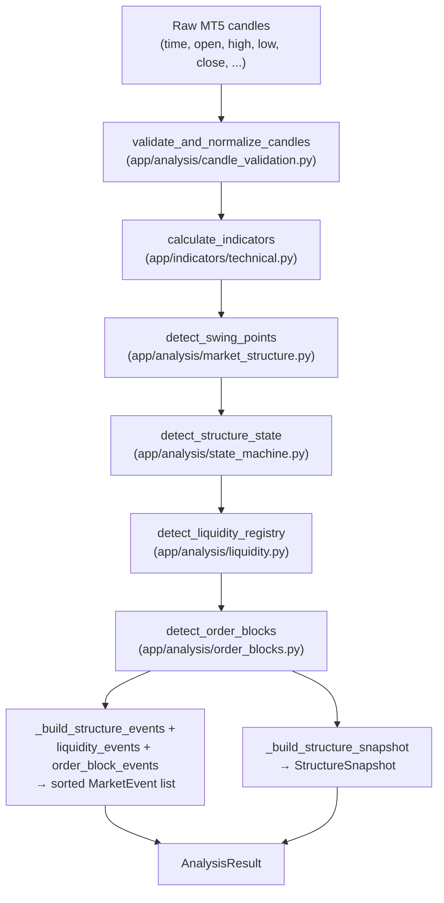

# Data Flow

Status: describes the canonical pipeline (`app/analysis/analysis_engine.py::analyze_market`) as implemented today. For the legacy pipeline's (much smaller) column set, see [§10](#10-legacy-pipeline-data-flow-for-comparison). For *why* the pipeline is shaped this way, see [ARCHITECTURE.md](ARCHITECTURE.md). For the state-machine internals, see [STATE_MACHINE.md](STATE_MACHINE.md). For Order Block internals, see [ORDER_BLOCKS.md](ORDER_BLOCKS.md).

Every stage below receives the *previous* stage's full DataFrame and returns `previous.copy()` with new columns added — no stage ever drops a column another stage produced. This means a column produced early (e.g. `atr14`) is still present, unchanged, in the very last DataFrame the pipeline produces (`order_block_dataframe`, exposed as `AnalysisResult.structure`).

## 1. MT5 → validated candles

**Owner:** `app/mt5/market.py::get_candles`, then `app/analysis/candle_validation.py::validate_and_normalize_candles`.

`get_candles(symbol, timeframe, count)` calls `MetaTrader5.copy_rates_from_pos`, converts the returned `time` column (Unix seconds) to UTC datetimes, and raises `RuntimeError`/`ValueError` if MT5 returns nothing or an empty result.

`validate_and_normalize_candles` is the **single, shared candle-hygiene gate** (`SMC_SPECIFICATION.md` §3, Decision A) — called by every one of the four candle-consuming endpoints and by `analyze_market()` itself, immediately after retrieval:

| Check | Outcome on failure |
|---|---|
| Required columns present (`time`, `open`, `high`, `low`, `close`) | `ValueError` |
| `time` parseable (numeric epoch-seconds or datetime-like) | `ValueError` |
| `open`/`high`/`low`/`close` finite (rejects NaN **and** ±Infinity) | `ValueError` |
| No duplicate timestamps (checked after sorting) | `ValueError` |
| `high >= open, close, low` and `low <= open, close, high` | `ValueError` |
| Empty DataFrame | `ValueError` |

**Normalisation performed (not rejected):** stable chronological sort by `time`; `RangeIndex` reset to `0..n-1` after sorting (this reset is what makes `enumerate(df.index)` in later stages equivalent to row position — see §8); `volume`, if present, coerced to numeric (invalid values become `NaN`, not rejected — `volume` is not a required field); every other extra column (`tick_volume`, `spread`, `real_volume`, …) is left completely untouched.

**Every rejection also produces a `logger.warning` summary** (row/column counts only, never full datasets) at the point of rejection — see [TROUBLESHOOTING.md](TROUBLESHOOTING.md#validation-failures).

## 2. Indicators

**Owner:** `app/indicators/technical.py::calculate_indicators`.

Adds, to the validated candle frame:

| Column | Formula |
|---|---|
| `ema20`, `ema50`, `ema200` | `close.ewm(span=N, adjust=False).mean()` |
| `rsi14` | Wilder-style, `alpha=1/14`. `100.0` when average loss is exactly zero (uninterrupted uptrend), `0.0` when average gain is exactly zero, `NaN` when both are zero (flat price — indeterminate) or on the first row (no prior close to diff against) |
| `macd`, `macd_signal`, `macd_histogram` | `ema12 - ema26`; signal is `macd.ewm(span=9, adjust=False).mean()` |
| `atr14` | Wilder-style true range, `alpha=1/14` |

No `min_periods` is set on any `.ewm()` call, so none of these columns carry a NaN "warm-up window" beyond the genuine first-row cases described above — they are numerically defined from row 0 onward, though early-row values naturally have less history behind them.

**Not consumed by the SMC engine:** `rsi14`, `macd*`, `ema20`/`ema50` are read only by `app/strategies/trend.py` and `app/strategies/multi_timeframe.py` (a separate, non-SMC feature). `state_machine.py`, `liquidity.py`, and `order_blocks.py` read only `atr14`, `close`, `high`, `low`, `open`, `time`. They still *carry these columns through* unchanged in every downstream DataFrame, purely as passthrough — this is why, for example, `rsi14` appears in the canonical endpoint's full `structure` response payload even though no structural decision ever reads it.

## 3. Swing detection

**Owner:** `app/analysis/market_structure.py::detect_swing_points` — shared verbatim by both the canonical and legacy engines; there is exactly one swing-detection algorithm in this codebase.

Adds `swing_high`, `swing_low` (bool) and `swing_high_price`, `swing_low_price` (float or `NA`). A candle at position `p` is a confirmed swing high iff `high[p] > max(high[p-left_bars:p])` **and** `high[p] > max(high[p+1:p+right_bars+1])` — both strict, both required; ties are excluded (not a swing). Swing low is the mirror, using `<`. Defaults: `left_bars=3`, `right_bars=3`. Requires at least `left_bars + right_bars + 1` rows or raises `ValueError`.

**Confirmation lag:** a swing at row `p` cannot be known until `right_bars` rows after `p` exist — the label is retroactive with respect to real time, by construction. See [ARCHITECTURE.md §2.4](ARCHITECTURE.md#24-historical-reproducibility-with-a-known-live-data-caveat).

## 4. Classification + state machine (canonical)

**Owner:** `app/analysis/state_machine.py::detect_structure_state`.

This is where the two engines structurally diverge — the canonical engine does **not** call `market_structure.py::classify_market_structure` first; it computes classification itself, inline, in the same forward pass as state-transition detection. Full mechanics, invariants, and worked examples: [STATE_MACHINE.md](STATE_MACHINE.md).

Columns added (all initialised to `pd.NA`/`"neutral"` and written per-row):

| Column | Meaning |
|---|---|
| `structure` | `HH` / `HL` / `LH` / `LL`, or unset for the first swing of each type in each trend cycle |
| `external_trend` | Confirmed trend: `neutral` / `bullish` / `bearish` — changes only on CHoCH |
| `structure_state` | Working state: adds `mss_bullish` / `mss_bearish` — changes on both MSS and CHoCH |
| `structure_event`, `event_direction` | `BOS` / `MSS` / `CHoCH` / `MSS_INVALIDATED`, with `bullish`/`bearish` direction, on the row it fires |
| `latest_swing_high`, `latest_swing_low` | Most recent *classified* swing of each type |
| `protected_high`, `protected_low` | The active protected level(s); see [STATE_MACHINE.md](STATE_MACHINE.md#4-protected-levels) |
| `protected_high_status`, `protected_high_source`, `protected_low_status`, `protected_low_source` | `status ∈ {active, broken}`, `source ∈ {hl, lh, latest_swing}` |
| `broken_level`, `break_distance`, `required_break_distance` | Populated on the row a BOS/MSS fires |
| `mss_confirmation_step` | `HL_CONFIRMED` / `LH_CONFIRMED` / `HL_TO_HH_CONFIRMED` / `LH_TO_LL_CONFIRMED`, on the relevant row only |
| `mss_origin_level`, `mss_origin_index` | The broken level and row *position* of the currently-pending MSS (both cleared at CHoCH confirmation or MSS invalidation) |
| `mss_invalidated_origin_index` | Populated only on the invalidation row — the join key back to the originating MSS |
| `trend_before_event`, `trend_after_event`, `state_before_event`, `state_after_event` | Snapshot of trend/state immediately before and after this row's processing |

`mss_origin_index` and every other `*_index` column in this pipeline is a **row position** (`enumerate(df.index)`), not a pandas index label — see §8.

## 5. Liquidity

**Owner:** `app/analysis/liquidity.py::detect_liquidity_registry`.

Consumes `structure`, `swing_high_price`, `swing_low_price`, `high`, `low`, `close`, `time` from the previous stage. Two consecutive same-type classified swings (`HH`/`LH` for highs, `HL`/`LL` for lows) within `tolerance_pips` of each other create a pool at their midpoint — this reads the **classified** column, so an unlabeled first-of-cycle swing never participates (a deliberate, spec-approved consequence of per-cycle classification, `SMC_SPECIFICATION.md` Appendix A).

| Column | Meaning |
|---|---|
| `equal_high`, `equal_high_level`, `equal_high_id` | Set on **both** member candles of a newly-formed BSL pool |
| `equal_low`, `equal_low_level`, `equal_low_id` | Mirror, for SSL |
| `liquidity_created`, `liquidity_type`, `liquidity_level`, `liquidity_id` | Set on the row a pool is created (the second/confirming swing's row) |
| `liquidity_swept`, `sweep_direction`, `sweep_distance`, `sweep_distance_pips`, `swept_liquidity_type/id/level` | A wick-based breach followed by a close-based reversion |
| `liquidity_broken`, `break_direction`, `break_distance`, `break_distance_pips`, `broken_liquidity_type/id/level` | A close decisively through the level, no reversion |
| `active_bsl_count`, `active_ssl_count` | Running count of still-active pools, written every row |

A pool is mutually exclusively swept **or** broken on a given row (checked via `if`/`elif`, since the two conditions are arithmetically incompatible: sweep requires the close to be back on the *origin* side of the level, break requires the close to be decisively past it). `maximum_age_bars` (age-based pool expiration) exists as a parameter but is not wired to any HTTP endpoint or to `analyze_market()`'s default call — reachable only via direct Python use of `detect_liquidity_registry(..., maximum_age_bars=N)`.

## 6. Order Blocks

**Owner:** `app/analysis/order_blocks.py::detect_order_blocks`.

Consumes `structure_event`, `event_direction`, `broken_level`, `mss_invalidated_origin_index` from the state-machine stage, plus (optionally) `liquidity_swept`/`sweep_direction` from the liquidity stage if `require_liquidity_sweep=True`. Full lifecycle detail: [ORDER_BLOCKS.md](ORDER_BLOCKS.md).

| Column | Meaning |
|---|---|
| `order_block_created`, `order_block_id`, `order_block_type`, `order_block_high/low`, `order_block_proximal/distal`, `order_block_candle_index/time` | Set on the row a new block is created |
| `order_block_mitigated`, `mitigated_order_block_id`, `mitigation_price`, `mitigation_percentage` | Set on the row price first trades into an active block's range |
| `order_block_invalidated`, `invalidated_order_block_id`, `invalidation_price` | Set on the row price closes beyond a block's distal level, **or** on the row its originating MSS invalidates |
| `order_block_confirmed`, `confirmed_order_block_id` | Set on the row an MSS-sourced block's originating MSS resolves into its own confirming CHoCH |
| `order_block_expired`, `expired_order_block_id` | Set on the row age-based expiration fires (only reachable via direct `maximum_age_bars` use, same caveat as liquidity) |
| `active_bullish_order_blocks`, `active_bearish_order_blocks` | Running counts, written every row |

This is the **final** DataFrame in the canonical pipeline — `AnalysisResult.structure` is exactly this frame, carrying every column from every earlier stage.

## 7. Events, snapshot, and the final result

**Owner:** `app/analysis/analysis_engine.py::analyze_market`.

1. `_build_structure_events(structure_dataframe)` converts every `BOS`/`MSS`/`CHoCH`/`MSS_INVALIDATED` row into a `MarketEvent`, computing `strength = break_distance / required_break_distance` where both are available (never for `MSS_INVALIDATED`/`CHoCH`, which are swing-driven, not close-distance-driven), and joining `MSS_INVALIDATED` events back to their originating `MSS` event's own `event_id` via a forward-built `{origin_position: event_id}` map (no look-ahead — an MSS always precedes its own eventual invalidation in row order).
2. This list is concatenated with `detect_liquidity_registry`'s and `detect_order_blocks`'s own returned event lists, then sorted once by `(time, index, event_id)` — `_sort_events`.
3. `_build_structure_snapshot(order_block_dataframe)` reads the **last row** of the final DataFrame for current trend/state/swing/protected-level values, and separately scans backward for the most recent `BOS`/`MSS`/`CHoCH` row (so the snapshot's `latest_event` doesn't incorrectly read `None` merely because the final candle itself has no event).
4. `AnalysisResult` bundles: `symbol`, `timeframe`, `candles` (the validated input), `structure` (final DataFrame), `liquidity_dataframe`, `events` (sorted `list[MarketEvent]`), `liquidity` (`list[LiquidityPool]`), `order_blocks` (`list[OrderBlock]`), `structure_snapshot`, `metadata` (includes `pipeline_version`, input/processed candle counts, per-stage event counts, and the exact kwargs each stage ran with).

## 8. Row-position indexing convention

Every `*_index` field anywhere in this pipeline (`mss_origin_index`, `order_block.created_index`, `MarketEvent.index`, etc.) is the **loop position** from `enumerate(dataframe.index)` — i.e. `0, 1, 2, …` in row order — never the pandas index *label*. This matters because it is the join key used across every stage: `order_blocks.py` reconstructs an MSS's `source_event_id` from `mss_invalidated_origin_index` using this exact convention (`f"STR_MSS_{position:05d}"`), and `analysis_engine.py` joins `MSS_INVALIDATED` events back to their originating `MSS` `MarketEvent` the same way. Since `validate_and_normalize_candles` always resets the index to a clean `RangeIndex` before anything downstream runs, row position and index label coincide in practice for the standard pipeline — but code should never rely on that coincidence; use `position`, not `index`.

## 9. Determinism guarantee

Nothing in §1–8 reads real-world time, random state, or any input other than the DataFrame(s) explicitly passed in. Given an identical candle history, every column above is reproduced identically on every run — enforced by golden-file regression tests run twice per suite execution, and once more in reverse test-file order. See [TESTING.md](TESTING.md#2-determinism).

## 10. Legacy pipeline data flow (for comparison)

**Owner:** `main.py::market_structure_endpoint` calling `market_structure.py` directly.

`detect_swing_points` (identical to §3 above) → `classify_market_structure` (adds `structure`, using a **global, never-reset** `previous_high`/`previous_low` baseline — the opposite of §4's per-cycle behaviour) → `detect_breaks_of_structure` (adds `bos`, `broken_level`, `break_distance`, `required_break_distance`) → `detect_change_of_character` (adds `choch`: fires when a `bos` direction differs from the immediately preceding `bos` direction — a much simpler model than the canonical engine's MSS/CHoCH state machine, with no protected levels, no invalidation concept, and no Order Block/liquidity stages at all).

This pipeline's output is intentionally frozen and does not evolve alongside §1–8 above — see [ARCHITECTURE.md §4](ARCHITECTURE.md#4-canonical-vs-legacy-engine).
