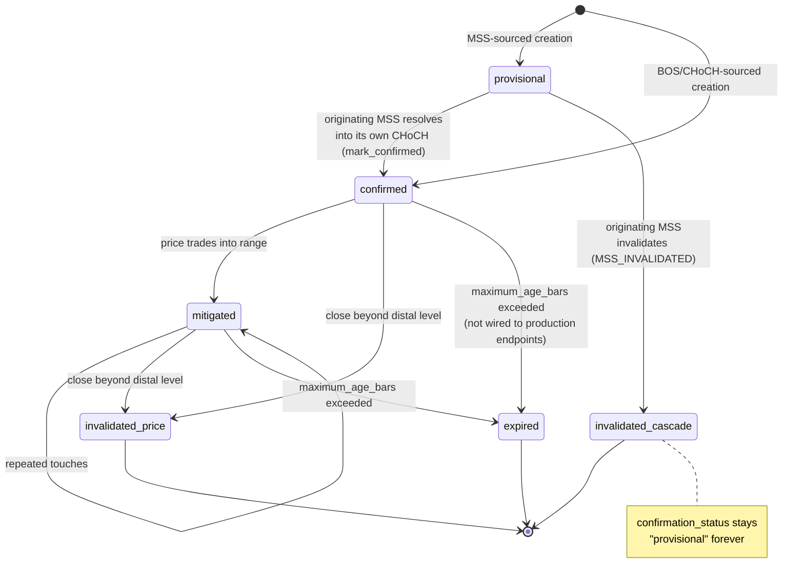
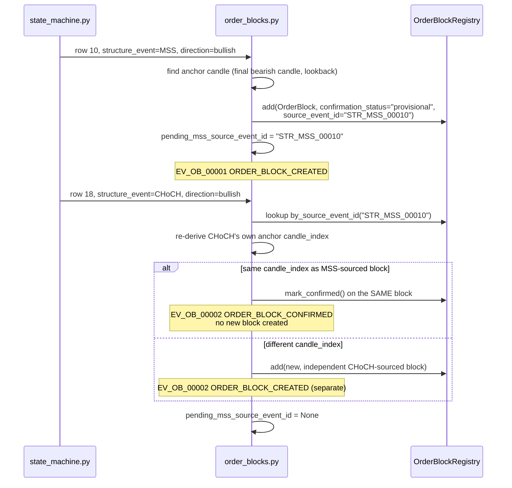

# Order Blocks

Status: describes `app/analysis/order_blocks.py::detect_order_blocks`, `app/analysis/order_block_registry.py::OrderBlockRegistry`, and `app/analysis/models.py::OrderBlock` exactly as implemented. Canonical-engine only — the legacy pipeline has no Order Block concept.

Governing spec: `SMC_SPECIFICATION.md` §28 (Decision #12), Appendix B.

## 1. Creation

Triggered by a structural event on the previous stage's output (`structure_event`, `event_direction`, `broken_level` from [STATE_MACHINE.md](STATE_MACHINE.md)):

1. `structure_event ∈ source_event_types` (default `{"BOS", "MSS", "CHoCH"}` — all three enabled by default, non-configurably as far as MSS is concerned per Decision #12 point 8) and `event_direction ∈ {"bullish", "bearish"}`.
2. The event candle's real body must be at least `minimum_event_body_ratio` (default `0.55`) of its full range, and its colour must match the event direction.
3. Walking backward up to `lookback_bars` (default `12`) candles, the **final opposite-colour candle** before the event becomes the block's anchor (`_find_order_block_candle`).
4. Displacement from that anchor candle to the event candle's close must be at least `atr14 × minimum_displacement_atr` (default `1.0` — deliberately a separate, independently-configured parameter from `state_machine.py`'s own `minimum_break_atr`, per Decision #9 point 5).
5. If `require_liquidity_sweep=True` (default `False`), a directionally-matching `liquidity_swept` row must exist somewhere between the anchor and the event candle.

A bullish block's `proximal_level`/`distal_level` are the anchor candle's `high`/`low`; a bearish block's are its `low`/`high` (proximal is always the edge closer to current price, distal the far edge).

**Confirmation status at creation:** MSS-sourced blocks are created `confirmation_status = "provisional"`; BOS- and CHoCH-sourced blocks are created `confirmation_status = "confirmed"` — terminal from the start, never touched by the promotion/invalidation-cascade machinery below.

## 2. Promotion (`provisional → confirmed`)

Only reachable for MSS-sourced blocks. When the pending MSS that created a provisional block resolves into its **own** confirming CHoCH (tracked via a single-slot `pending_mss_source_event_id`, safe because [STATE_MACHINE.md §5](STATE_MACHINE.md#5-pending-mss-and-confirmation-flags) guarantees only one MSS can ever be pending at a time):

- If the CHoCH's own anchor candle (independently re-derived via `_find_order_block_candle`) has the **same** `candle_index` as the pending MSS-sourced block → that block is promoted **in place** via `OrderBlock.mark_confirmed()` (`confirming_event_id`, `confirming_event_type="CHoCH"`, `confirmed_time`, `confirmed_index` populated; `source_event_id`/`source_event_type`/`created_index` untouched — the block's original MSS provenance and creation timestamp are preserved permanently). **No duplicate block is created** for this row.
- If the anchor candles differ → the MSS-sourced block is left confirmed on its own, independent history, and a **separate**, independently-tracked CHoCH-sourced block is created (Section 3's normal creation logic proceeds for this row).

Promotion is one-way and occurs **at most once** per block — no later structural event may re-promote or revert an already-confirmed block.

## 3. Mitigation

On any row after a block's own creation row (never on or before it): if a later candle's `[low, high]` range overlaps the block's `[low, high]` range, the block is mitigated — `mark_mitigated()` records `mitigation_price` (clamped to the block's own range) and `mitigation_percentage` (0–100%, how deep price penetrated from the proximal edge). `touches` increments. Mitigation does not terminate the block — an already-mitigated, still-active block can be mitigated again on a later row (each occurrence gets its own `ORDER_BLOCK_MITIGATED` event), until invalidated.

## 4. Invalidation

Two independent triggers, both terminal (one-way, `status="invalidated"`):

- **Price penetration** (`invalidation_reason="price_penetration"`, the default): a later candle's `close` moves decisively beyond the block's distal level (beyond `invalidation_confirmation_pips`, default `0.0`).
- **MSS-invalidation cascade** (`invalidation_reason="mss_invalidated"`): when the state machine emits `MSS_INVALIDATED`, `order_blocks.py` reconstructs the originating MSS's `source_event_id` from `mss_invalidated_origin_index` and invalidates **every still-`active`** block sourced from that exact MSS occurrence — the cascade never touches a block that has already reached a terminal status (mitigated, expired, or already invalidated).

`confirmation_status` is **never** touched by the cascade — an MSS-sourced block invalidated this way stays `"provisional"` permanently (an explicit `[APPROVED SPEC]` "must not" requirement, Decision #12, verified by a dedicated regression test).

## 5. Expiration

`maximum_age_bars` (optional, default `None`) expires still-active blocks whose `current_position - created_index >= maximum_age_bars`, via `OrderBlockRegistry.expire_old_order_blocks()`. The DataFrame columns (`order_block_expired`, `expired_order_block_id`) are set, but **no `MarketEvent` is emitted for expiration** — every other lifecycle transition described above does emit one; expiration does not. `maximum_age_bars` is not wired to any HTTP endpoint or to `analyze_market()`'s default call — reachable only via `detect_order_blocks(..., maximum_age_bars=N)` directly. See [TROUBLESHOOTING.md](TROUBLESHOOTING.md#missing-order-blocks) if this matters for a specific investigation.

## 6. Lifecycle diagram

`is_active` (a computed property, not a stored field) is `True` only while `status == "active"` and none of `mitigated`/`invalidated`/`expired` are set — mitigation, notably, does **not** end activity; only invalidation and expiration do.

## 7. Creation → promotion sequence (worked example)

## 8. Registry (`OrderBlockRegistry`)

An in-memory, per-pipeline-run object store — not the event log (see [ARCHITECTURE.md §6](ARCHITECTURE.md#6-registries-are-not-the-event-log)). `add()` rejects a duplicate `order_block_id` (`ValueError`). Query methods: `all(sorted_by_time=...)`, `active(order_block_type=...)`, `by_status()`, `by_source_event_id()` (the exact lookup the promotion/invalidation-cascade logic uses), `latest()`, `count()`, `expire_old_order_blocks()`.

## 9. Events emitted

`ORDER_BLOCK_CREATED`, `ORDER_BLOCK_MITIGATED`, `ORDER_BLOCK_INVALIDATED` (both invalidation reasons), `ORDER_BLOCK_CONFIRMED`. **Not emitted:** an expiration event — `EventType` has no `ORDER_BLOCK_EXPIRED` value at all (a known, documented gap; see [TROUBLESHOOTING.md](TROUBLESHOOTING.md#missing-events)). Every emitted event's `event_id` follows `EV_OB_{n:05d}`, incrementing per `detect_order_blocks()` call — stable and deterministic for a fixed input, not stable across separate calls with different inputs.

## 10. Cross-references

- Upstream `structure_event`/`mss_invalidated_origin_index` semantics: [STATE_MACHINE.md](STATE_MACHINE.md).
- Full column reference: [DATA_FLOW.md §6](DATA_FLOW.md#6-order-blocks).
- `require_liquidity_sweep`'s dependency on the liquidity stage: [DATA_FLOW.md §5](DATA_FLOW.md#5-liquidity).
