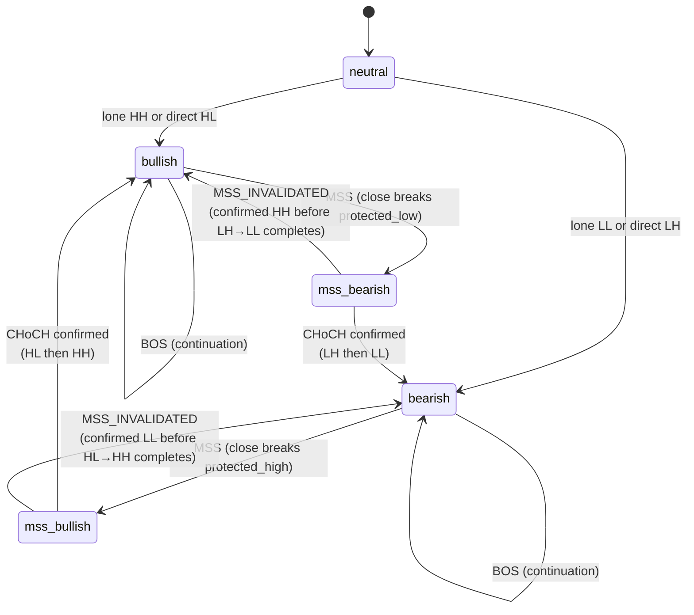
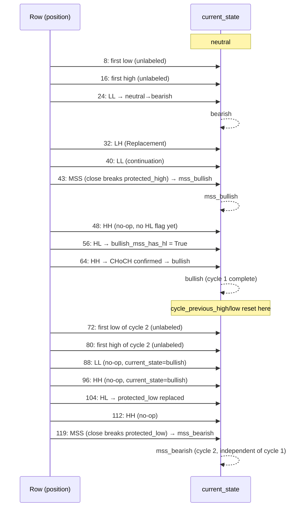

# State Machine

Status: describes `app/analysis/state_machine.py::detect_structure_state` (the **canonical** engine) exactly as implemented. The legacy engine's much simpler BOS/CHoCH model (`app/analysis/market_structure.py`) is described only for contrast in [ARCHITECTURE.md §4](ARCHITECTURE.md#4-canonical-vs-legacy-engine) and [DATA_FLOW.md §10](DATA_FLOW.md#10-legacy-pipeline-data-flow-for-comparison) — not repeated here.

Governing spec: `SMC_SPECIFICATION.md` §7 (Decision #3, classification), §10/§11/§26/§27 (Decisions #10/#11/#15, protected levels), §19 (Decision #6, MSS invalidation), §20 (Decision #7, CHoCH permanence), §22 (Decision #8, event ordering).

## 1. The two parallel state variables

```python
current_trend  ∈ {neutral, bullish, bearish}                    # confirmed trend — changes only on CHoCH
current_state  ∈ {neutral, bullish, bearish, mss_bullish, mss_bearish}  # working state — changes on both MSS and CHoCH
```

Invariant, holds at every row: `current_state ∈ {current_trend, "mss_" + current_trend}` for `current_trend ∈ {bullish, bearish}`, and `current_state == "neutral"` iff `current_trend == "neutral"`.

## 2. Classification: HH / HL / LH / LL

Each confirmed swing high is compared to `cycle_previous_high` (strict `>` → `HH`, else `LH`); each confirmed swing low to `cycle_previous_low` (strict `>` → `HL`, else `LL`). An exact tie folds to `LH`/`LL` — ties are never "progress" by definition (Decision #4).

**The comparison baseline is per-trend-cycle, not global** (Decision #3): `cycle_previous_high`/`cycle_previous_low` reset to `None` the moment a CHoCH confirms — but only for swings *after* that row; the CHoCH-confirming swing itself stays classified under the baseline of the cycle it completes. The first qualifying swing of each type after a boundary is therefore unlabeled (no baseline yet), exactly like the very first swing of the whole series — once per cycle, not once ever. This is computed in the *same* forward loop as state-transition detection (§4 below), never as a separate prior pass — see [ARCHITECTURE.md §2.2](ARCHITECTURE.md#22-single-causally-forward-pass).

A separate, whole-series-scoped tracker (`latest_detected_swing_high`/`_low`) records the latest swing-*confirmed* price regardless of whether it was ever classified — this is what powers reseeding (§5) and is deliberately **not** reset at cycle boundaries (§27's residual-gap clause is scoped "in the series" as a whole).

## 3. Events

| Event | Fires when | Direction |
|---|---|---|
| `BOS` (Break of Structure) | `current_state == "bullish"` and `close` breaks above `active_bullish_bos_level` by ≥ `atr14 × minimum_break_atr` (mirror for bearish) | trend-following |
| `MSS` (Market Structure Shift) | `current_state == "bullish"` and `close` breaks below `protected_low` by the same ATR threshold (mirror for bearish) | reversal *attempt* |
| `CHoCH` (Change of Character) | `current_state == "mss_bullish"` and `bullish_mss_has_hl` is `True`, and the next classified swing is `HH` (mirror for bearish: `mss_bearish` + `bearish_mss_has_lh` + next `LL`) | **confirmed** reversal |
| `MSS_INVALIDATED` | `current_state == "mss_bearish"` and a confirmed `HH` occurs before its confirming `LH`/`LL` sequence completes (mirror: `mss_bullish` + confirmed `LL`) | reasserts the pre-MSS trend |

**MSS does not immediately reverse `current_trend`.** It only changes `current_state` to `mss_bullish`/`mss_bearish` — a *pending* reversal attempt. `current_trend` changes only when that attempt is confirmed by a CHoCH.



Note the diagram's `mss_bearish --> bearish` / `mss_bullish --> bullish` transitions via `MSS_INVALIDATED` are labelled by their **resulting `current_state`**, which reverts to the trend that was already, and remains, active — `current_trend` itself never changed during the pending-MSS phase.

## 4. Protected levels

`protected_high`/`protected_low` are the levels whose break triggers an MSS. Each has an independent `status ∈ {active, broken}` and `source ∈ {hl, lh, latest_swing}` (Decision #10, §26) — two axes tracked separately: `status` says whether the level is currently trustworthy, `source` says how it was established, and neither is touched outside the four transitions below (Decision #15, §10 — a closed set, verified by dedicated invariant tests).

| Transition | When | Effect |
|---|---|---|
| **Creation** | Trend initialises from neutral (direct HL/LH), or via reseed (lone HH/LL with no matching direct swing yet), or via CHoCH promotion | New value, `status="active"`, `source` per the sub-case |
| **Replacement** | A new HL arrives while already `bullish` (mirror: LH while `bearish`) | Value updated, `status="active"`, `source` upgraded to `hl`/`lh` if it was `latest_swing` |
| **Reseed** | MSS invalidates | The *opposite* level (the one that survived) re-seeded from the latest swing-confirmed price of that type, `status="active"`, `source="latest_swing"` |
| **Clearing** | CHoCH confirms | The now-irrelevant opposite level cleared to `None`/`None`/`None`, paired with the promoted level's Creation |

When an MSS fires, the broken level's `status` flips to `"broken"` — its **value and source are left untouched**, for transparency (Decision #10). It stays visibly stale until either a CHoCH clears it or an `MSS_INVALIDATED` reseeds it.

### Reseeding (`reseed_from_latest_swing`)

One shared helper, reused by both the lone-HH/LL trend-initialisation case and the post-invalidation reseed (Decision #11/#6, §27): seeds a protected level from the latest swing-confirmed (not necessarily classified) opposite-type price. If no such swing has ever occurred, returns `(None, None, None)` — the accepted residual gap: no seed value exists, and the level genuinely stays unset until a real swing of that type is classified.

## 5. Pending MSS and confirmation flags

While `current_state` is `mss_bullish`/`mss_bearish`, two boolean flags track confirmation progress: `bullish_mss_has_hl` / `bearish_mss_has_lh`. A confirming-type swing (HL during `mss_bullish`) sets the flag and records `mss_confirmation_step`. The *next* swing of the trend-completing type (HH) then reads the flag to decide CHoCH vs. no-op. `mss_origin_level`/`mss_origin_index` track the broken level and its row position for the duration of the pending phase — both cleared at CHoCH confirmation *and* at MSS invalidation (§19).

**Only one MSS can be pending at a time** — `current_state` is a single value, so a second MSS cannot begin while one is already unresolved. `order_blocks.py` relies on this exact invariant for its own single-slot `pending_mss_source_event_id` tracking (see [ORDER_BLOCKS.md](ORDER_BLOCKS.md)).

**Two table cells are deliberately `UNDEFINED`**, not silently "fixed": an `LH` arriving during `mss_bullish` (not the confirming type, not the invalidating type) and an `HL` arriving during `mss_bearish` — both remain no-ops, pinned by regression tests, per §21's own state-transition table.

## 6. Event ordering (Decision #8)

Within one row, at most one `structure_event` can fire, in this precedence: **CHoCH / MSS_INVALIDATED (swing-driven, Step 1) > MSS > BOS (both close-driven, Step 3/4)**. The missing-data guard (a row with `NaN` close or ATR) only ever suppresses the close-driven MSS/BOS checks — a CHoCH or MSS_INVALIDATED already determined at Step 1 always survives to the output row, since it reads neither `close` nor ATR.

## 7. Dual-swing precedence (out of scope, preserved as-is)

If a single candle is simultaneously a confirmed swing high *and* swing low, two independent `if` blocks run — whichever runs second (the swing-low check) silently overwrites `structure_type` if both fire. This is legacy behaviour, explicitly out of scope for Decision #3 (§22 point 1), preserved unchanged.

## 8. Invariants

- **`[INVARIANT]` Unified forward pass** (§7 point 5): classification at row `T` depends only on state from rows `< T`; a cycle boundary at row `T` depends only on classification already computed at `T` and earlier.
- **`[INVARIANT]` No retroactive relabeling** (§7 point 3): once a swing is classified, its label is permanent regardless of any later cycle boundary.
- **`[INVARIANT]` No two-pass bootstrap** (§7 point 6): computing CHoCH boundaries under a global scheme, then reclassifying per-cycle, is not merely disallowed — it is unreliable, since a swing forced to `LH`/`HL` by a cycle-irrelevant historical extreme can suppress a CHoCH that per-cycle rules would confirm.
- **`[INVARIANT]` CHoCH permanence** (§20, Decision #7): a confirmed CHoCH's `external_trend` is never altered by anything except a fully independent, later-confirmed opposite-direction CHoCH.
- **`[INVARIANT]` Protected-level closed set** (§10, Decision #15): only Creation/Replacement/Reseed/Clearing ever write `protected_high`/`protected_low` or their status/source fields — verified by property tests asserting no other code path (BOS triggering, MSS confirmation-flag bookkeeping) ever touches them.

## 9. Worked example: two full trend cycles

Built with `tests/helpers/candles.py::build_zigzag_candles` (`candles_per_leg=8`) over the waypoint sequence `[1.2000, 1.1950, 1.2020, 1.1850, 1.1900, 1.1800, 1.2100, 1.1950, 1.2200, 1.2100, 1.2300, 1.2000, 1.2350, 1.2150, 1.2450, 1.2050]` — the exact fixture verified in `tests/test_phase7_per_cycle_classification.py`. Row numbers are candle positions.



Key, independently-verified facts from this fixture (see `test_phase7_per_cycle_classification.py` for the exact assertions):

- Row 64's own `structure` is `HH`, classified under **cycle 1's** baseline — not reset by the CHoCH it itself triggers.
- Rows 72 and 80 are unlabeled — cycle 2's own first low/high, correctly *not* compared against cycle 1's last classified low/high (proven directly: running the same swings through the **legacy** global classifier instead labels row 72 `HL` and row 80 `HH` — the exact cross-cycle leakage per-cycle classification exists to prevent).
- `protected_low` is not replaced in cycle 2 until row 104 (the *second* new-cycle low) — row 72, being unlabeled, never triggers a Replacement.
- The two MSS occurrences (rows 43 and 119) have fully independent `mss_origin_index` values (`43` and `119` respectively) — no leakage of cycle 1's pending-MSS bookkeeping into cycle 2.

## 10. Cross-references

- Row-position (`mss_origin_index`) vs. pandas index label: [DATA_FLOW.md §8](DATA_FLOW.md#8-row-position-indexing-convention).
- How `order_blocks.py` consumes `structure_event`/`mss_invalidated_origin_index`: [ORDER_BLOCKS.md](ORDER_BLOCKS.md).
- Full column reference: [DATA_FLOW.md §4](DATA_FLOW.md#4-classification--state-machine-canonical).
